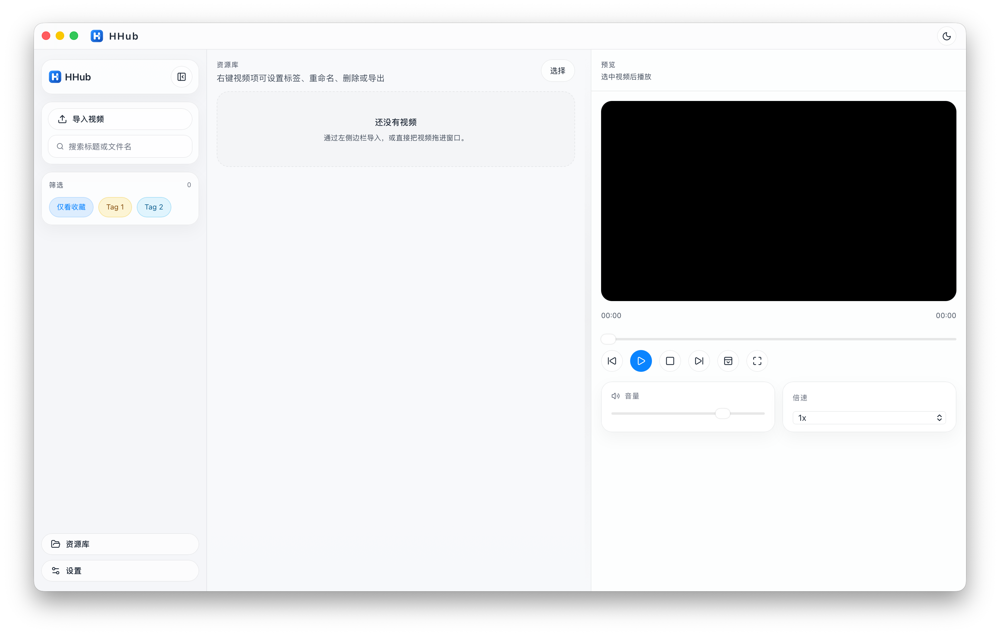

# HHub

<p align="center">
  
</p>

<p align="center">
  A polished desktop video library for local media management.<br />
</p>

<p align="center">
  
  
  
  
</p>

## Overview

HHub is a local-first video manager focused on a clean desktop workflow: import videos, organize them with tags, preview and play them inside the app, and keep sensitive content behind an optional app lock.

## Screenshots



## Features

- Import local videos from the file picker, drag and drop, or clipboard paste.
- Organize videos with favorites, rename, delete, export, and tag management.
- Filter the library by favorites, tags, and search keywords.
- Play videos inside the app with seek, volume, rate control, theater mode, and fullscreen.
- Use delayed delete with undo to reduce accidental removals.
- Protect the app with an optional password lock.
- Pause or lock automatically when the window loses focus.
- Enjoy a compact macOS-inspired interface with a custom title bar and collapsible sidebar.

## How to use

```bash
pnpm install
pnpm tauri build
```
